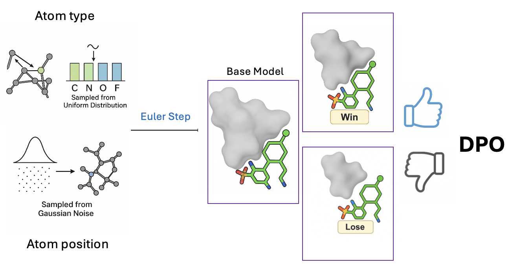

# MolFORM: Multi-modal Flow Matching for Structure-Based Drug Design
[](https://github.com/huang3170/MolForm/blob/main/LICENSE)


This repository contains the official implementation of the flow matching diffusion model for small molecules generated using the DPO optimization. [Paper](https://arxiv.org/abs/2507.05503)
<p align="center">
  
</p>

## Data
The standard training data is prepared as follows: [Targetdiff](https://github.com/guanjq/targetdiff).
The DPO optimized data is prepared folows [Alidiff](https://github.com/MinkaiXu/AliDiff)
Both standard training/DPO traning checkpoints for sampling is stored at ([google drive](https://drive.google.com/drive/folders/1pSYNKvdFKdkGLYfTqjIU1yW9gIN5Zd25?dmr=1&ec=wgc-drive-hero-goto))

## Training
The codebase now supports both:
1. **Standard Training**: Original diffusion model training
2. **DPO Training**: Preference-based optimization using paired data


### Standard Training

To run standard diffusion model training (original behavior):

```bash
# No DPO data provided - uses standard training
python scripts/train_diffusion.py configs/training_standard.yml --tag standard_training
```

Or use the provided script:
```bash
./script_run/run_train_standard.sh
```

### DPO Training

To run DPO training, you need:
1. A reference model checkpoint
2. DPO preference data (pkl format)
3. DPO-specific configuration

```bash
# DPO data provided - enables DPO training
python scripts/train_diffusion.py \
    configs/training_dpo.yml \
    --tag dpo_training \
    --dpo_data /path/to/your/dpo_data.pkl
```

Or use the provided script:
```bash
./script_run/run_train_dpo.sh
```

## Configuration

### Standard Training Config
Use `configs/training_standard.yml` (existing configuration)

### DPO Training Config
Use `configs/training_dpo.yml` with additional parameters:

```yaml
model:
  ref_model_checkpoint: ./path/to/reference/model.pt  # Required for DPO

train:
  beta_dpo: 5                    # DPO beta for continuous losses
  discete_beta_dpo: 0.1         # DPO beta for discrete losses
  # ... other standard parameters
```

## DPO Data Format

The DPO data file should be a pickle file containing preference pairs:
```python
# dpo_data.pkl structure
{
    winning_sample_id: [losing_sample_id_1, losing_sample_id_2, ...],
    # ... more preference pairs
}
```

## Model Methods

### Standard Training
- `get_diffusion_loss()`: Original loss calculation

### DPO Training  
- `get_diffusion_loss_dpo()`: DPO loss with preference optimization
- `get_diffusion_loss()`: Standard loss for validation during DPO training

## Implementation Details

### DPO Loss Components
- **Position Loss**: MSE loss with DPO preference ranking
- **Chamfer Loss**: Chamfer distance with DPO ranking
- **Atom Type Loss**: Cross-entropy loss with DPO ranking

### Reference Model
- Loaded from `config.model.ref_model_checkpoint`
- Frozen during training (no gradient updates)
- Used to compute reference predictions for DPO loss

## Validation

During DPO training, validation uses the standard loss calculation to maintain compatibility with existing evaluation metrics.

## Notes

- DPO training typically requires a lower learning rate (e.g., 5e-8)
- The reference model should be a well-trained checkpoint from standard training
- DPO training is designed for fine-tuning, not training from scratch
